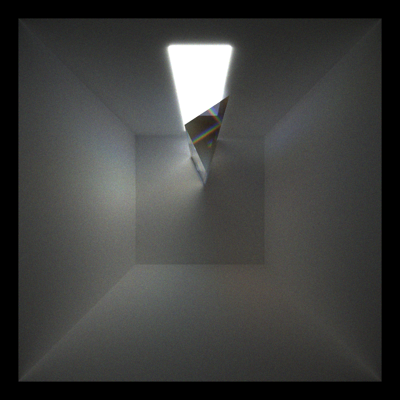
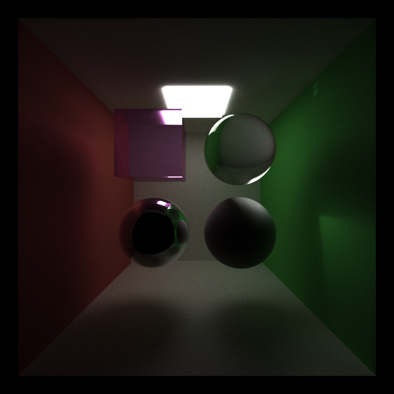
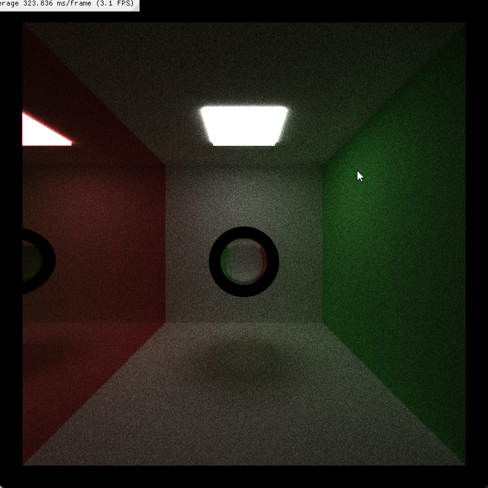
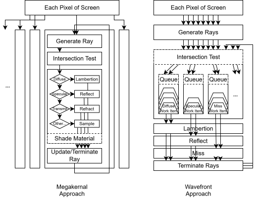
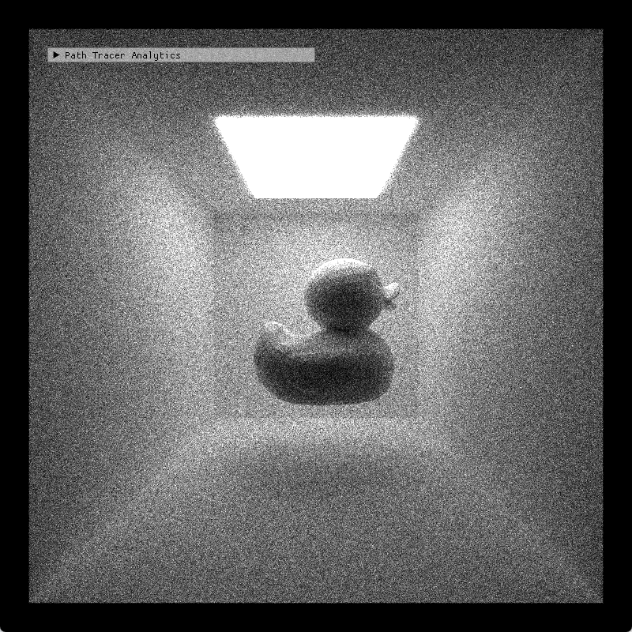

CUDA Path Tracer
================

**University of Pennsylvania, CIS 565: GPU Programming and Architecture, Project 3**

  * Xiaonan Pan
    * [LinkedIn](https://www.linkedin.com/in/xiaonan-pan-9b0b0b1a7), [My Blog](www.tsingloo.com), [GitHub](https://github.com/TsingLoo)
  * Tested on: 
    * Windows 11 24H2
    * 13600KF @ 3.5Ghz
    * 4070 SUPER 12GB
    * 32GB RAM

## Feature List

- Diffuse BSDF, Perfect Reflection & Refraction
- Depth of Field
- glTF Loading
- Stochastic Antialiasing
- Fake Spectral Rendering, Dispersion
- Russian Roulette Path Termination
- Wavefront Path Tracing

## Visual Feature Details

### Diffuse BSDF, Perfect Reflection & Refraction

- **Lambertian Diffuse**: Cosine-weighted hemisphere sampling for diffusion sampling. 
- **Perfect Reflection & Refraction**: Fresnel-based refraction using [`FrDielectric()`](https://www.pbr-book.org/4ed/Reflection_Models/Specular_Reflection_and_Transmission#FrDielectric) for glass material.

#### Debug 

The provided code inverts the surface normals when a ray is inside a glass medium and exiting. Furthermore, this method of ray-sphere intersection is yielding less accurate intersection values compared to the `solveQuadratic` approach. Initially, the resulting dark ring artifact led to the discovery that a larger EPSILON value was necessary to visually mitigate the rendering bug.

### Depth of Field

- Allow adjust three parameters `Focal Length`, `Aperture` `Focus Distance`like a real camera through `"FOCALLENGTH"`, `FAPERTURE`, `"FOCUSDISTANCE"` of camera in scene `.json` file.

### Wavefront Path Tracing

As shown in the diagram, [a wavefront path tracer](https://research.nvidia.com/sites/default/files/pubs/2013-07_Megakernels-Considered-Harmful/laine2013hpg_paper.pdf) **breaks a megakernel into multiple kernels, each dedicated to a specific task** of the path tracing pipeline. The provided code implements part of this concept, as it separates the "Compute Intersection" and "Shade Material" stages.

However, control flow divergence within a single shade material stage remains a primary concern. Because objects in the scene have different materials, it is inefficient if some threads in a warp are performing expensive refraction calculations while others are handling simple Lambertian diffusion. All threads within that warp must stall until the most expensive calculation is complete.

To mitigate this divergence, the wavefront approach creates a dedicated kernel for each material type by **partitioning** the tasks into different work item queues. In my implementation, these **queues are populated during the compute intersection stage**. Each specialized kernel is then launched with a number of threads corresponding to the size of its queue. This eliminates divergent branches within the shading kernels, ensuring high GPU utilization.

An alternative to partitioning tasks into separate queues is a **sort-in-place** approach. In this method, the single, large buffer of work items is sorted by material ID. Afterward, a pass can determine the start index and count for each contiguous block of materials. Finally, a dedicated kernel is launched for each material type, configured to operate only on its specific slice of the sorted buffer. This **material-sorting strategy was implemented in the `main` branch**, but its full integration into the dispatch and shading loop has not yet been explored.

As this is a performance optimization, the rendered results for the same scene are expected to be **exactly** the same; only the performance will differ, which will be discussed in the following section.

### glTF Loading

glTF is a standard file format for three-dimensional scenes and models. In my implementation, the Transformations (TRS), normals, and base colors of the objects were extracted correctly. However, the material properties are not currently working well.

### Fake Spectral Rendering, Dispersion

