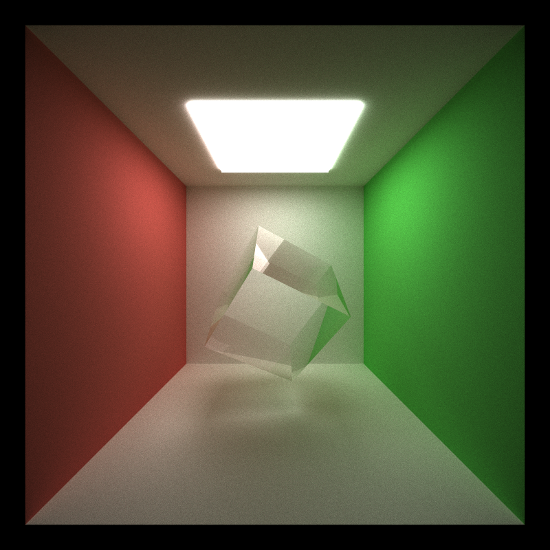
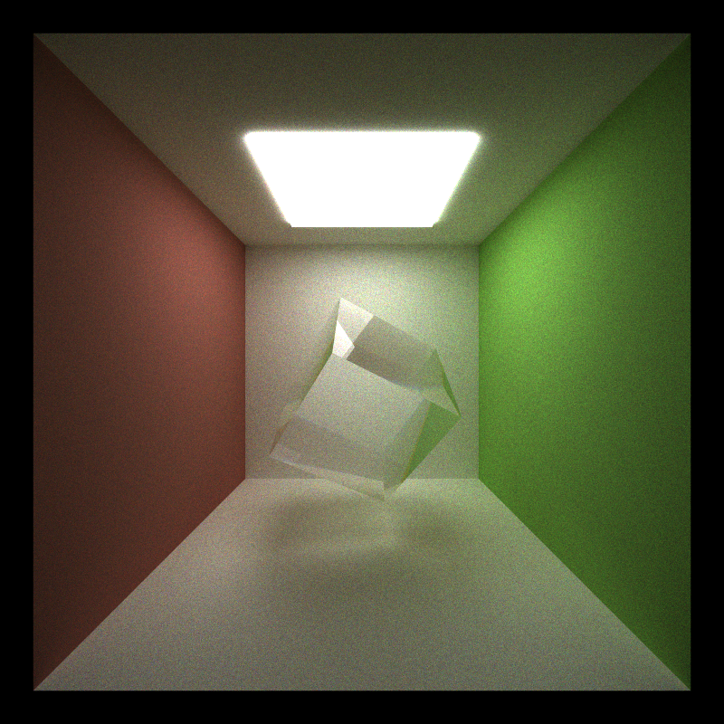
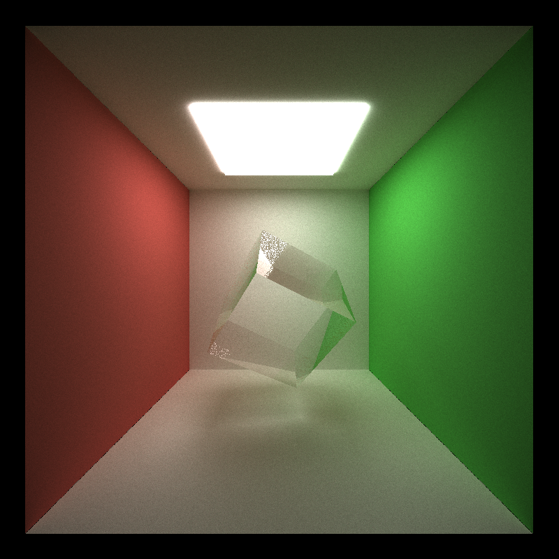
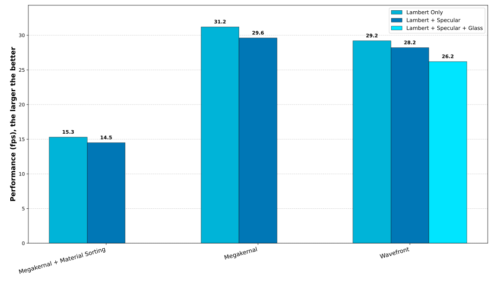
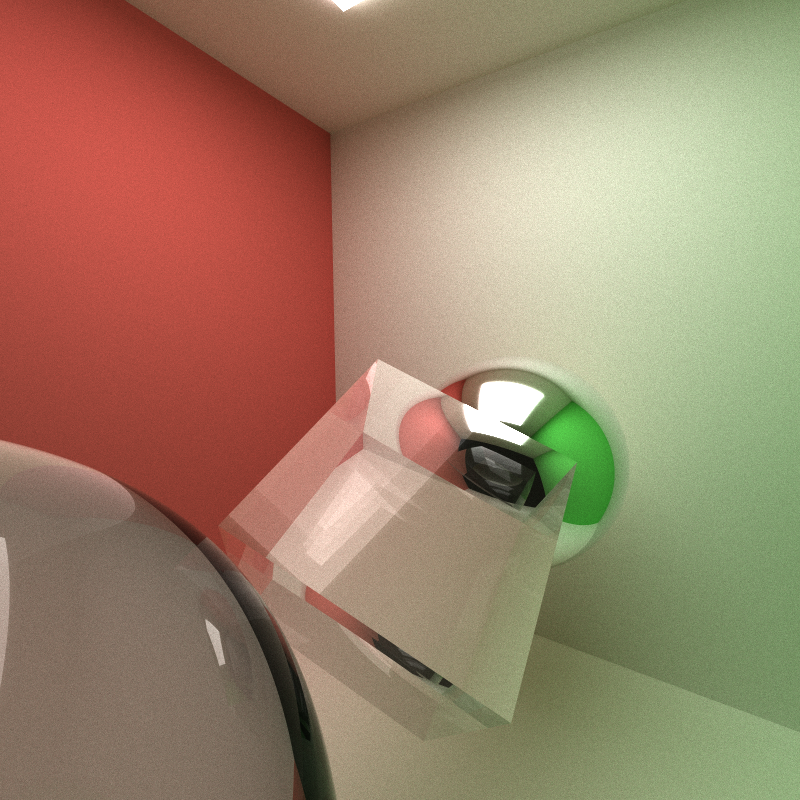
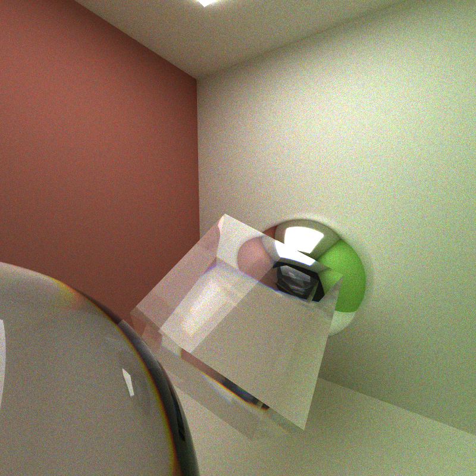
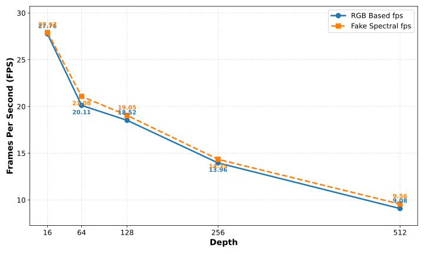

CUDA Path Tracer
================

**University of Pennsylvania, CIS 565: GPU Programming and Architecture, Project 3**

  * Xiaonan Pan
    * [LinkedIn](https://www.linkedin.com/in/xiaonan-pan-9b0b0b1a7), [My Blog](www.tsingloo.com), [GitHub](https://github.com/TsingLoo)
  * Tested on: 
    * Windows 11 24H2
    * 13600KF @ 3.5Ghz
    * 4070 SUPER 12GB
    * 32GB RAM

## Feature List

- Diffuse BSDF, Perfect Reflection & Refraction
- Depth of Field
- glTF Loading
- Stochastic Antialiasing
- Fake Spectral Rendering, Dispersion
- Wavefront Path Tracing

## Feature Details

### Diffuse BSDF, Perfect Reflection & Refraction

`./scenes/cornell_defuse_scene.json`

- **Lambertian Diffuse**: Cosine-weighted hemisphere sampling for diffusion sampling. 
- **Perfect Reflection & Refraction**: Fresnel-based refraction using [`FrDielectric()`](https://www.pbr-book.org/4ed/Reflection_Models/Specular_Reflection_and_Transmission#FrDielectric) for glass material.

#### Debug 

The provided code inverts the surface normals when a ray is inside a glass medium and exiting. Furthermore, this method of ray-sphere intersection is yielding less accurate intersection values compared to the `solveQuadratic` approach. Initially, the resulting dark ring artifact led to the discovery that a larger EPSILON value was necessary to visually mitigate the rendering bug.

### Depth of Field (DoF)
| Aperture 1.2, Focal Distance 1.5 | Aperture 22, Focal Distance 1.0 |
| -------------------------------- | ------------------------------- |
|   |     |

`./scenes/cornell_dof.json`

- Allow adjust three parameters `Focal Length`, `Aperture` `Focus Distance`like a real camera through `"FOCALLENGTH"`, `FAPERTURE`, `"FOCUSDISTANCE"` of camera in scene `.json` file.

### glTF Loading

`./scenes/cornell-whiteduck.json`

glTF is a standard file format for three-dimensional scenes and models. In my implementation, the Transformations (TRS), normals, and base colors of the objects were extracted correctly. However, the material properties are not currently working well.

### Fake Spectral Rendering, Dispersion

| RGB Based Rendering     | Fake Spectral Rendering     |
| ----------------------- | --------------------------- |
|  |  |

`./scenes/cornell_show_dispersion.json`

In the physical world, light is characterized not by RGB values, but by its wavelength. A significant visual phenomenon resulting from this is dispersion, which occurs because the index of refraction (IOR) of a medium is physically dependent on the wavelength of light (λ). For example, sunlight is a continuous spectrum spanning roughly 400 nm (purple) to 700 nm (red). When this light passes through a transmissive object, such as a prism, the variation in IOR causes the light to separate, creating a visible spectrum or color band. This physical effect is why we observe rainbows after rain and color fringing near caustics.

To simulate this spectral effect, my implementation treats light as wavelength instead of the traditional RGB model. When the camera generates rays (`CameraGenerateRays`), each ray randomly samples a single wavelength from the spectrum. All subsequent physical interactions (refraction, reflection) are calculated based on this single sampled wavelength, using the **λ-dependent index of refraction**. This approach effectively introduces an **additional dimension of integration over the wavelength spectrum** into the Monte Carlo path tracing integral.

My current approach relies on several assumptions and approximations. When a ray hits a Lambertian material, the ray's **throughput is determined by the sampled wavelength and the object's RGB value components**. For instance, if the sampled wavelength is λ=680 nm ("red" because >600 nm), I use the object's **Red component** (`color.r`) to calculate reflectivity. This coarse approximation, which maps a continuous spectral response to discrete RGB components, leads to **energy loss**, causing the final image to appear somewhat **desaturated or "grayed out."**, that's why I call this feature is fake. The correct method would require a Spectral Reflectance Curve to describe how the material responds to every wavelength. Implementing this level of accuracy is currently beyond the scope of my capabilities.

When the ray finally terminates at a light source, the accumulated spectral result is converted back to an RGB color using a **fitting function** implemented in [HIPRT-Path-Tracer](https://github.com/TomClabault/HIPRT-Path-Tracer/blob/main/src/Device/includes/Dispersion.h). This final RGB value is then saved to the image buffer.

#### Dispersion

The strength of the **dispersion** is governed by the **Index of Refraction (IOR)** `"IOR"`and the **Abbe number** `"ABBE"`. IOR describes a medium's ability to refract a light ray and Abbe describes the **rate of change of IOR** as a function of wavelength.

A material with **low dispersion** (or a high Abbe number) will **exhibit a wider color band but with lower radiant energy concentration in any single spot**. Conversely, high dispersion (low Abbe number) yields a stronger radiance concentration in a narrower band. Due to the high sensitivity and small size of these narrow bands, simulating them accurately requires significantly more samples because the probability of a randomly sampled ray hitting that specific, highly concentrated light region is low.

### Stochastic Antialiasing

| On                      | Off                            |
| ----------------------- | ------------------------------ |
|  |  |

`./scenes/cornell_show_dispersion.json`

For each pixel, every iteration generates a ray with a slightly different, random starting point on that pixel. It is the essential mechanism that provides the **random samples** required for the path tracer to work correctly and converge to a final image. If it is turned off, the path is deterministic that it will have the same color outcome everytime.

### Wavefront Path Tracing

As shown in the diagram, [a wavefront path tracer](https://research.nvidia.com/sites/default/files/pubs/2013-07_Megakernels-Considered-Harmful/laine2013hpg_paper.pdf) **breaks a megakernel into multiple kernels, each dedicated to a specific task** of the path tracing pipeline. The provided code implements part of this concept, as it separates the "Compute Intersection" and "Shade Material" stages.

However, control flow divergence within a single shade material stage remains a primary concern. Because objects in the scene have different materials, it is inefficient if some threads in a warp are performing expensive refraction calculations while others are handling simple Lambertian diffusion. All threads within that warp must stall until the most expensive calculation is complete.

To mitigate this divergence, the wavefront approach creates a dedicated kernel for each material type by **partitioning** the tasks into different work item queues. In my implementation, these **queues are populated during the compute intersection stage**. Each specialized kernel is then launched with a number of threads corresponding to the size of its queue. This eliminates divergent branches within the shading kernels, ensuring high GPU utilization.

An alternative to partitioning tasks into separate queues is a **sort-in-place** approach. In this method, the single, large buffer of work items is sorted by material ID. Afterward, a pass can determine the start index and count for each contiguous block of materials. Finally, a dedicated kernel is launched for each material type, configured to operate only on its specific slice of the sorted buffer. This **material-sorting strategy was implemented in the `main` branch**, but its full integration into the dispatch and shading loop has not yet been explored.

As this is a performance optimization, the rendered results for the same scene are expected to be **exactly** the same; only the performance will differ, which will be discussed in the following section.

## Performance Analysis

### Wavefront Path Tracing

Although the wavefront approach mitigates the divergence issue, it introduces **an additional partitioning stage** to sort the work. In my implementation, a large block of memory (equal to the total number of paths) is pre-allocated for each dedicated kernel to ensure sufficient space. `atomicAdd` is then used to safely manage concurrent writes to these queues. The hypothesis is that for scenes with few material types, where divergence is not a severe problem, the overhead of this approach may cause it to be slower than a simple megakernel.

*Note that these results are scene-dependent. The performance impact of divergence can vary based on the scene's material composition. Furthermore, since the computational cost is not identical for each material implementation, the specific materials used can also introduce variability into the benchmarks.*

As shown in the graph,**the standard Megakernel approach is the fastest for rendering the scene (DoF showcase) when it contains only one (Lambertian) or two (Lambertian + Specular) material types**, slightly outperforming the Wavefront approach. A huge performance drop was observed with the "Megakernel + Material Sorting" method, which is likely due to the overhead of executing a separate `thrust::stable_sort` pass on every bounce.

Surprisingly, while the Wavefront method's partitioning achieves the same goal as material sorting, it does not suffer the same dramatic performance penalty. This suggests that its integrated "intersect-and-partition" kernel is more efficient than running a separate, generic sort.

When adding the new Glass material, the Wavefront approach's performance dropped by 3.42% (from 29.2 to 28.2 fps). In comparison, the Megakernel approach saw a larger performance drop of 5.12% (from 31.2 to 29.6 fps). This result supports the expectation that **the Wavefront architecture can handle new, complex material types at a smaller relative performance cost**. This benefit should become more pronounced as the number of divergent materials in the scene increases.

### Fake Spectral Rendering, Dispersion

| RGB Based Rendering           | Fake Spectral Rendering                |
| ----------------------------- | -------------------------------------- |
|  |  |

`./scenes/cornell_dof.json`

*Note that the fake spectral approach requires more time to converge, as it adds an additional integration domain over the light's wavelength*

The performance of the spectral renderer is consistently slightly better than the RGB-based one. I think the  primary reason for this is a reduction in **memory bandwidth**. In spectral mode, each path stores a `float wavelength` and a `float throughput` (8 bytes total), whereas in RGB mode, it must store a `glm::vec3` color (12 bytes). 

## Third Party Libraries

- This project uses the [tinygltf](https://github.com/syoyo/tinygltf) library to load glTF 2.0 models. It is included as a Git submodule located in the `external/tinygltf` directory. The `CMakeLists.txt` file is configured to handle this dependency automatically.

  *Please use the `--recurse-submodules` command to clone this project correctly*

- The code for handling IOR calculation and Wavelength-RGB conversion is adapted from the [HIPRT-Path-Tracer](https://github.com/TomClabault/HIPRT-Path-Tracer/blob/main/src/Device/includes/Dispersion.h).
